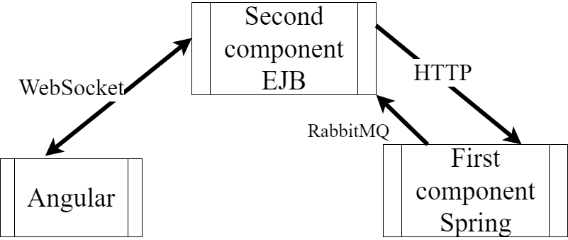

# MobileOperatorJavaSchoolT

This repository represent my project for Deutsche Telekom Java School (spring 2022)  
The project keeps changing  
Links for other part parts of project:
- EJB part https://github.com/mrKust/BridgeBeetwenMobileOperatorJavaSchoolTParts
- Angular part https://github.com/mrKust/ng-MobileOpereatorJavaSchoolTSecondPart
 System scheme: 

- Main criteries for successful ending:
    - Functionality is working :white_check_mark:
    - Maven based -- Build :white_check_mark:
      -- Deploy :white_check_mark:
    - Main structure implements CRUD operations :white_check_mark:
    - Connected to MySQL :white_check_mark:
    - Mapping objects to Data Base's tables :white_check_mark:
    - Classes connected through DAO :white_check_mark:
    - Deployed on AS :white_check_mark:
    - Exception Handeling :white_check_mark:
    - Logging :white_check_mark:
    - Technical solution description :white_check_mark:
    - Unit-test for buisness logic :white_check_mark:  
  <!-- end of the list -->

  <!-- :white_check_mark: -->
