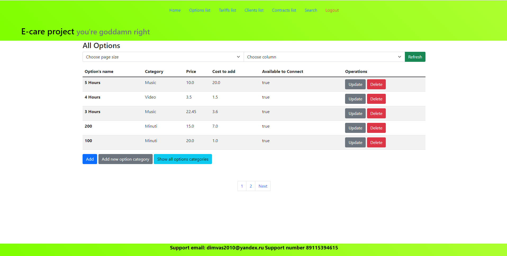
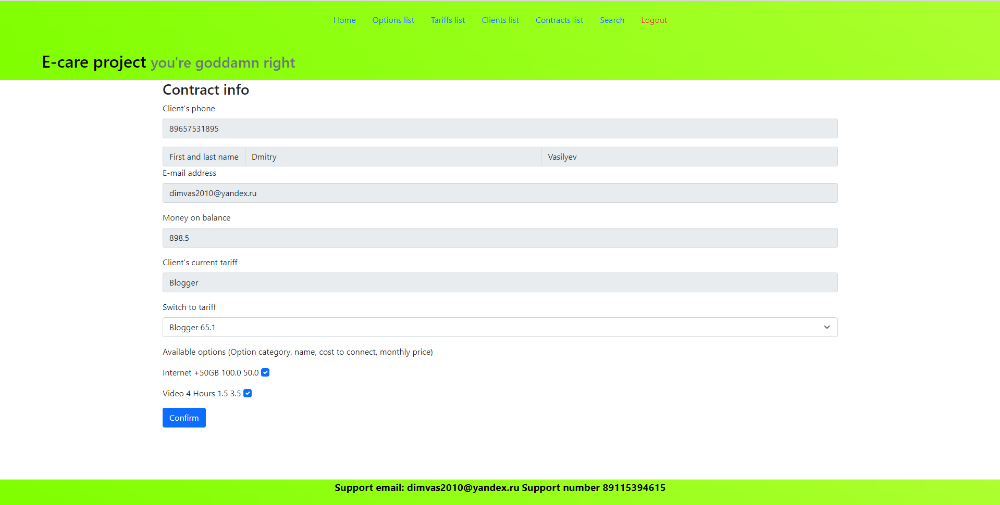
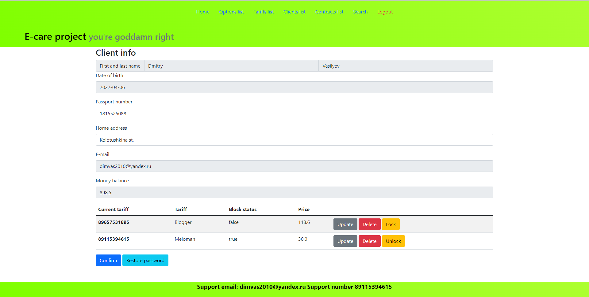
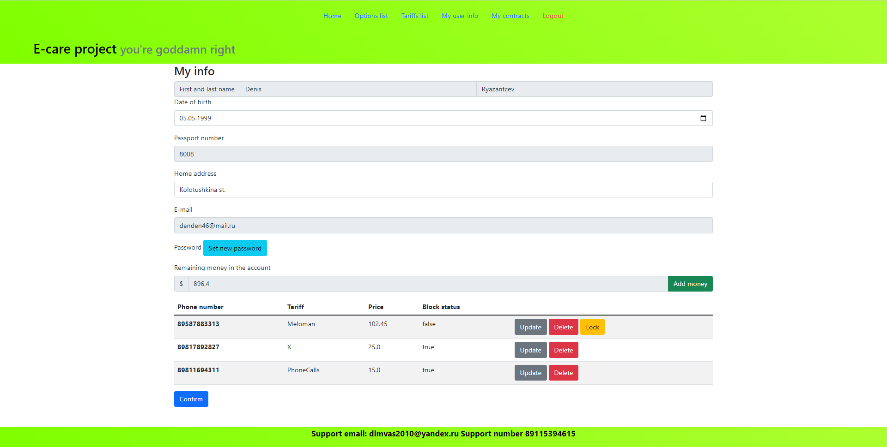
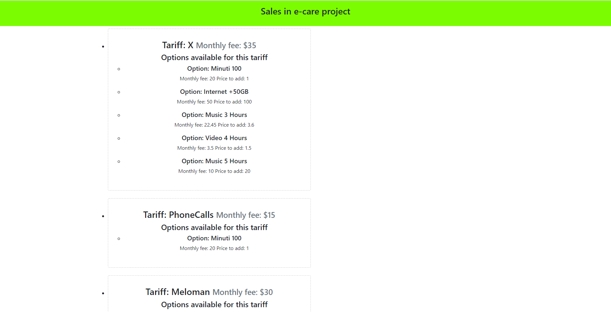

# MobileOperatorJavaSchoolT

This repository represent my project for Deutsche Telekom Java School (spring 2022)  
The project keeps changing  
#### Project theme: CRM system for mobile operator
Links for other part parts of project:
- EJB part https://github.com/mrKust/BridgeBeetwenMobileOperatorJavaSchoolTParts
- Angular part https://github.com/mrKust/ng-MobileOpereatorJavaSchoolTSecondPart   
#### Project structure

 Project contains three parts. You can see structure of project on picture 1.  
<strong>First one</strong> is a CRM systems which allows to create and manage mobile operator's options, tariffs, clients and their contracts. System has to types of access. One is for mobile operator's employee this part named "Control plane" and the other one is for clients. It is named as "User plane". In control plane user can create or update new options, tariffs, client's accs and manage clients contracts. In user plane client can look on available to connect options and tariffs, also he can change his own account info or manage their contracts. You can see examples of system work on pictures 2 - 5. 
<strong>Second part</strong> is like bridge between first and second one. Second part have one singleton bean inside it. In this bean we store list of available to connect tariffs with options for it. Every time when user changes tariff or option system send to MQ broker messages about changes. Second part gets MQ messages, after than it takes new version and sends it to the third part. 
<strong>Third part</strong> is a simple angular page. It connects throug web socket to the second part and only recieves new version of tariff's list and presents it on the main page. Example of the third part info you can see on the picture 6.
 
  

- Main criteries for successful ending (list of things which should be released by Java School):
    - Functionality is working :white_check_mark:
    - Maven based -- Build :white_check_mark:
      -- Deploy :white_check_mark:
    - Main structure implements CRUD operations :white_check_mark:
    - Connected to MySQL :white_check_mark:
    - Mapping objects to Data Base's tables :white_check_mark:
    - Classes connected through DAO :white_check_mark:
    - Deployed on AS :white_check_mark:
    - Exception Handeling :white_check_mark:
    - Logging :white_check_mark:
    - Technical solution description :white_check_mark:
    - Unit-test for buisness logic :white_check_mark:  
  <!-- end of the list -->

  <!-- :white_check_mark: -->
